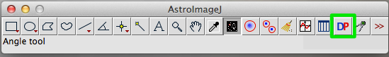
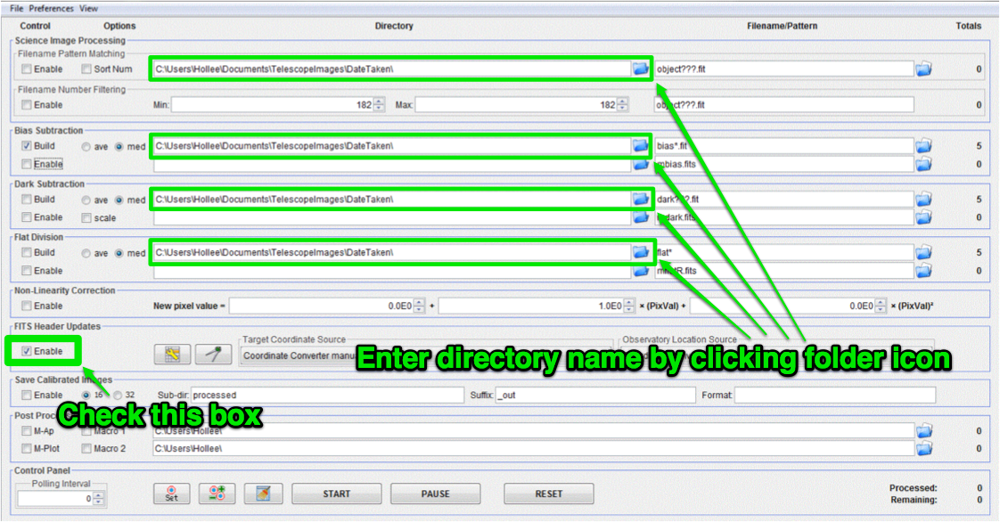
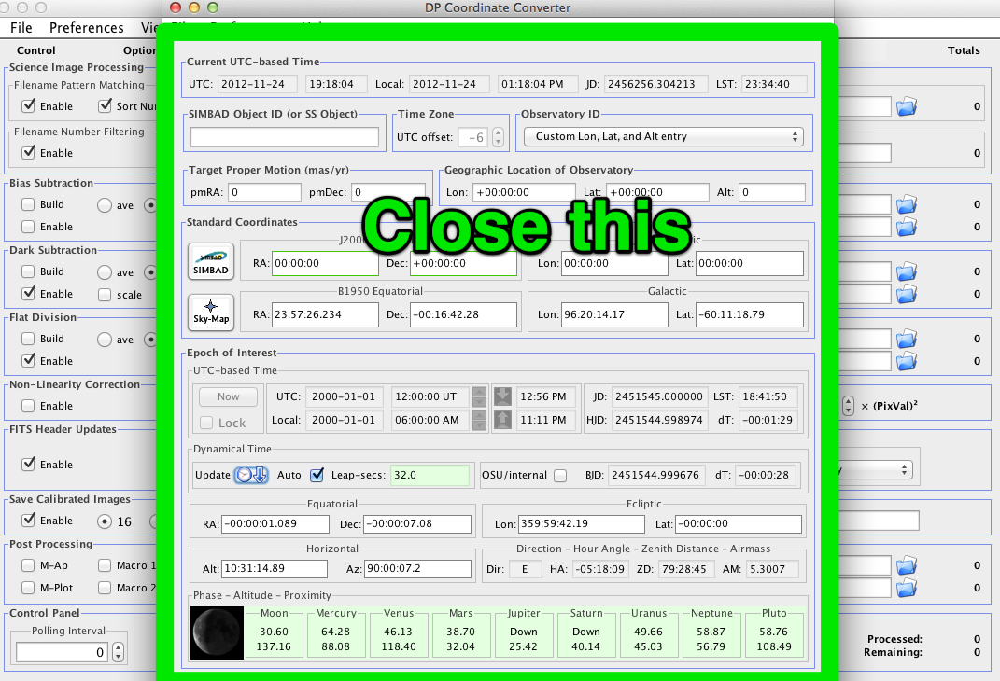

(Semi) Automated reduction in AstroImageJ
==========================================

`AstroImageJ` can automate much of the image reduction you have learned this semester. That can be very convenient, but (with apologies to Stan Lee) 

`With great (data processing) power comes great responsibility`_
----------------------------------------------------------------

You *will* make mistakes when using a computer to automate image reduction. Taking careful notes and paying close attention to what you are doing can help *reduce* the frequency with which it happens, but at the end of the day you should expect that mistakes will happen.

The way to deal with that fact--that mistakes will be made--is to build into your procedures for reducing data ways to check for mistakes. How do you check? The best way is to actually look at your images: the raw calibration files, the calibration masters and the raw and reduced data. 

.. note::
    In the lab today you can click on any thumbnail image to see a full-size version of the image.

Getting to the automated image reduction tool in AstroImageJ
--------------------------------------------------------------

Click the thumbnail images below to see a full-size version.

#.  Open *AstroImageJ* (it will be called just *ImageJ* on your computer).
#.  Click the DP button |dp|
#.  Two windows will open; close the one titled "DP Coordinate Converter" |dpcc|
#.  Set the directory to the folder containing your images in each of the four places indicated. |dp-dirs|

The next few sections of the lab will take you through creating a master bias, master dark, and master flat frame, and applying those calibration frames to science images.

.. note::
    *AstroImageJ* does allow you to do all of these steps at once. Please **do not** today...it is extraordinarily easy to create a large number of incorrect files in a short amount of time.

.. _get_organized: 

Get organized before you get going
-----------------------------------

You have two options at this stage:

+ Stop reading here, start trying to make your masters, find you have made several avoidable errors and repeat several times until you get it right.
+ Keep reading. 

You have `chosen wisely`_.

To keep things organized you want to start by figuring out what calibration images you need to use. A typical night's worth of data will likely have calibration files you don't need for your particular project or will have different calibration files needed for different parts of whatever science you are doing.

To figure out what calibration files you need start by opening one of the uncalibrated science images...in the end you are doing calibration because you want to do with science, so the only answer to question "What calilbration files do I need?" is "That depends; what does calibrating your science image require?"

The answer to that question always involves looking at the FITS header of your science image.

.. todo::
    #. As a refresher, write down the three basic types of calibration you do to images.
    #. Open one of the science images you have been asked to reduce. 
    #. Based on the exposure time and filter of the image, what calibration files will you need?
    #. Are there additional calibration images you need to calibrate the calibration images in the previous question? If yes, what are they?
    #. Are there calibration images you need that do *not* depend on exposure time or filter? What are they?

    **You should end this section of questions with a clear list** of the calibration images you will need (e.g. flats in the Z filter, darks with an exposure time of 120 hours).

    **Check your list with any one of the instructors before you move on.**

.. _With great (data processing) power comes great responsibility: http://en.wikipedia.org/wiki/Uncle_Ben#.22With_great_power_comes_great_responsibility.22

.. _chosen wisely: http://www.imdb.com/title/tt0097576/trivia?tab=qt

