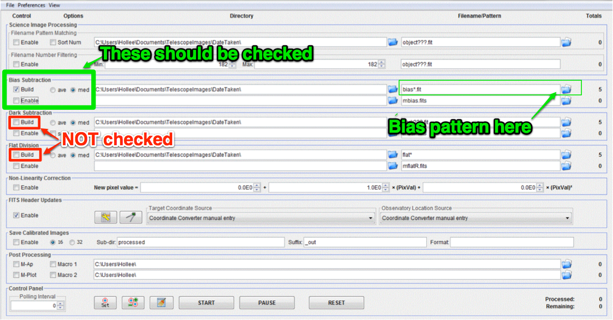

.. _master_bias:

Make a master bias image
=========================

Change the settings in the "DP" window to match those below.

|mb|

#.  Check only the following: 

    * Bias Subtraction -> Build 
    * Bias Subtraction -> med

#.  Find and enter file pattern of bias, e.g. “bias006” or “eyumabias” or “dark_bias”…can be weird sometimes, so watch out.

    #.  You can use ``?`` to replace one character or ``*`` to replace multiple characters, e.g. ``bias???.fit`` could replace a series which looks like ``bias242.fit``, or ``*bias*`` could replace a series which looks like ``dark_bias_7.fit``

#.  Make sure number in Totals next to Bias Subtraction top row is equal to number of bias you have
#.  Choose a name to save master as, e.g. ``mbias`` or ``master_bias``
#.  Click start and watch for errors

.. todo::
    #. How many bias frames *should* be included by the this automated tool? *Note:* there is no fancy way to figure this out. Look at the file names.
    #. Does the master bias image that you produced look like a master bias should? By this point you should have some rough idea of what a master bias looks like and you should have notes on what the typical pixel value is in a bias frame. Check both of those things.
    #. Compare your master bias image to the appropriate :ref:`reference_images`  to make sure they are really the same. Do that by loading both your master bias and ours and using *AstroImageJ* to take the difference or the ratio (what would you expect for either?). 

