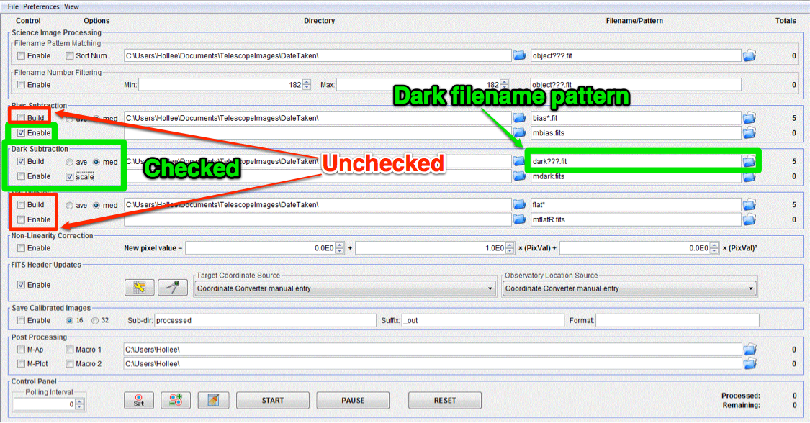

Make master dark image
======================

.. todo::

    #. Review the list of calibration files you made in :ref:`get_organized`. How many master dark images will you need to make?

Change the settings in the "DP" window to match those below.

|md|

#.  Check only the following: 

    * Bias Subtraction -> Enable
    * Dark Subtraction -> Build
    * Dark Subtraction -> Scale 
    * Dark Subtraction -> med

#.  Note that since scale is set, it is not necessary to have darks the same length as your science images...though it’s still nice
#.  Find and enter file name pattern for the darks *you need*. 

    + See instructions for :ref:`master_bias` for tips on writing file name patterns
    + Review your notes from :ref:`get_organized`

#.  Make sure number in Totals next to Dark Subtraction top row is equal to number of darks you need
#.  Make sure number in Totals next to Bias Subtraction second row is 1
#.  Choose a name to save master as, e.g. “mdark” or “master_dark”. Remember that you may need to make more than one master dark, so a specific name is better than a generic name. 
#.  Click start and watch for errors

.. todo::
    #. How many dark frames *should* be included by the this automated tool for each of the master darks you need to create? *Note:* there is no fancy way to figure this out. Look at the file names.
    #. Does the master dark image(s) that you produced look like a master dark should? By this point you should have some rough idea of what a master dark looks like and you should have notes on what the typical pixel value is in a dark frame. Check both of those things.
    #. Compare your master dark image(s) to the appropriate :ref:`reference_images`  to make sure they are really the same. Do that by loading both your master dark(s) and ours and using *AstroImageJ* to take the difference or the ratio (what would you expect for either?). 

