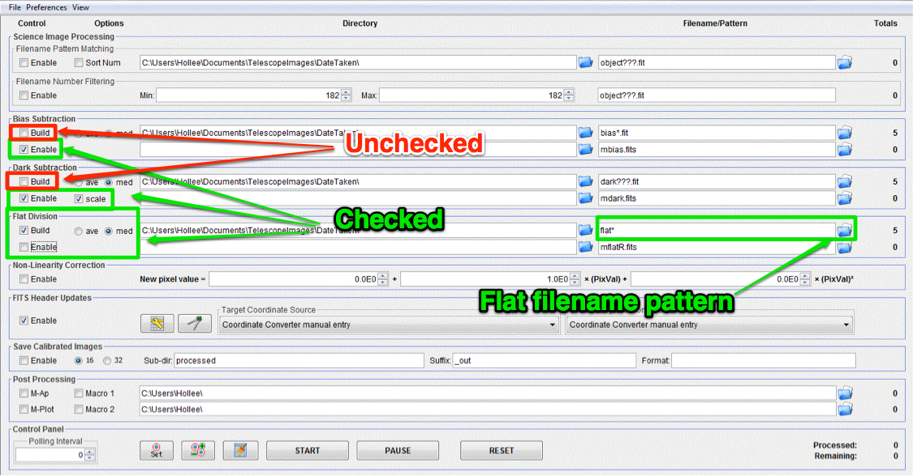
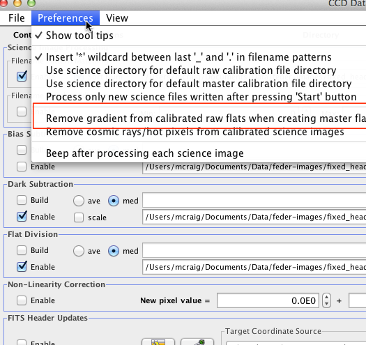

.. _master_flat:

Make master flat image
======================

.. todo::

    #. Review the list of calibration files you made in :ref:`get_organized`. How many master flat images will you need to make? What filter(s)? 
    #. What calibration frames will you need to make your master flat?

Change the settings in the "DP" window to match those below.

|mf|

#.  Check only the following:

    * Bias Subtraction -> Enable
    * Dark Subtraction -> Enable
    * Dark Subtraction -> Scale
    * Flat Division -> Build
    * Flat Division -> med

#.  Under the Preferences menu in the "CCD Data Processor" window, make sure "Remove gradient from calibrated raw flats when creating master flats" option is UNCHECKED.  |rg|
#.  Find and enter file pattern of flats; see instructions for master bias for tips.
#.  Make sure number in Totals next to Flat Division top row is equal to number of flats you have
#.  Make sure number in Totals next to Dark Subtraction second row is 1, *and that you are using a master dark of the appropriate exposure*.
#.  Choose a name to save flat
#.  Click start and watch for errors

.. todo::
    #. How many flat frames *should* be included by the this automated tool for each of the master flats you need to create? *Note:* there is no fancy way to figure this out. Look at the file names.
    #. Does the master flat image(s) that you produced look like a master flat should? By this point you should have some rough idea of what a master flat looks like and you should have notes on what the typical pixel value is in a flat frame. Check both of those things.
    #. Compare your master flat image(s) to the appropriate :ref:`reference_images`  to make sure they are really the same. Do that by loading both your master flat(s) and ours and using *AstroImageJ* to take the difference.  
    	- **NOTE**: If there turn out to be tiny differences, they may appear to be more significant than they are when displayed, since *AstroImageJ* scales the image to the range of values in the image.  A better test might be taking the RATIO of your flat versus the reference flat image if your flat and our reference flat are just offset from each other by a tiny but constant fraction.

