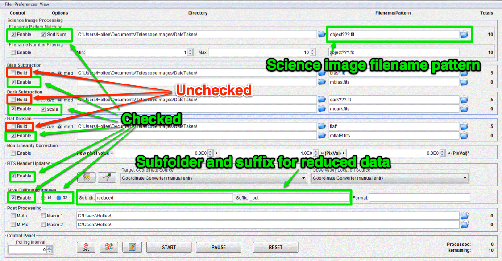

Reduce science image(s)
=======================

.. note:: You only need to calibrate the images for the filter, R, V, or B, that you have been assigned.
    Though it isn't the best way to specify the filter, look for it in the file name and **verify it** by looking at the FITS header.

Change the settings in the "DP" window to match those below.

|reduce|

#.  Check only the following:

    * Filename Pattern Matching -> Enable
    * Filename Pattern Matching -> Sort Num 
    * Bias Subtraction -> Enable
    * Dark Subtraction -> Enable
    * Dark Subtraction -> Scale
    * Flat Division -> Enable
    * Save Calibrated Images -> Enable
    * Save Calibrated Images -> 32

#.  Find and enter file pattern for science images; see master bias instructions for tips.
#.  Make sure number in Totals next to Science Image Processing first row is equal to number of science images you have
#.  Make sure number in Totals next to dark subtraction second row is 1 **AND** that it is the right exposure time.
#.  Make sure number in Totals next to Flat division second row is 1 **AND** that it is the right filter.
#.  Pick a subdirectory for your reduced science images and enter it into Save Calibrated Images -> Sub-dir. If the directory doesn’t already exist, AstroImageJ will create it for you.
#.  Pick a suffix for your reduced science images, default is ``_out``
#.  Click start and watch for errors

.. todo::
    #. How many science frames *should* be included by the this automated tool? *Note:* there is no fancy way to figure this out. Look at the file names.
    #. Does the calibrated science image look sensible? By now you should be able to recognize if there are obvious defects (e.g. dust donuts)
    #.  Compare your science image(s) to the appropriate :ref:`reference_images`  to make sure they are really the same.

