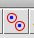
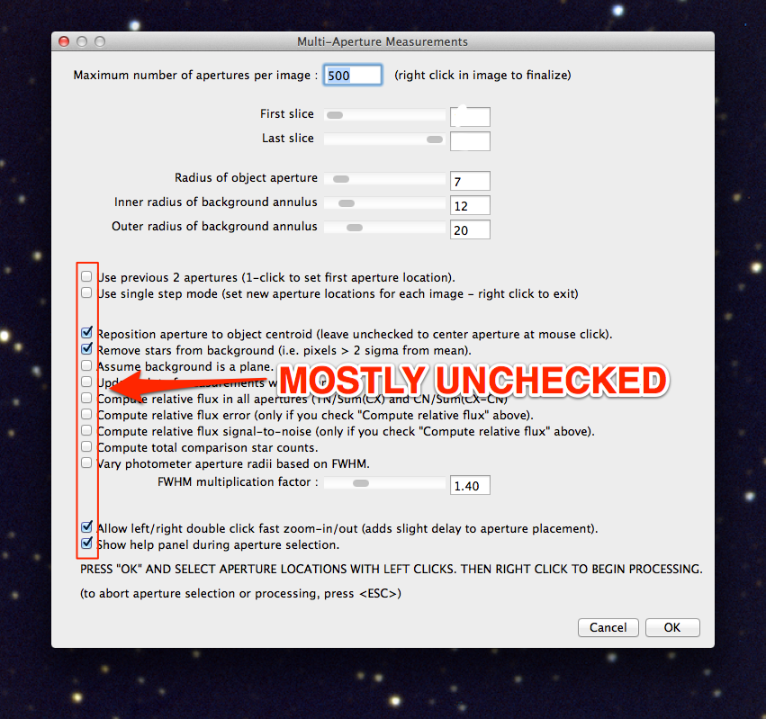
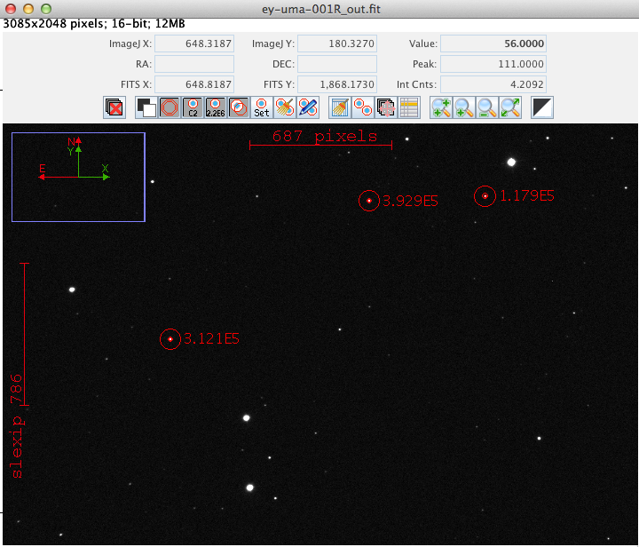

Multi-aperture photometry in AstroImageJ
=========================================

AstroImageJ, like other similar software packages, makes it easy to do photometry on several stars at once. 

Multi-aperture photometry is a little more interesting if there is more than one image to work on (but note, for the record, that you could do multi-aperture photometry on a *single* image, which might be useful for, say, a star cluster), so... 

+ Open all of the EY UMa images in a stack.
+ **MAKE VERY SURE YOU CHECK THE "Use virtual stack" BOX**. If you forget, ImageJ will complain, then quit.

+ Once you have the stack open, click the multi-aperture photometry tool: |multi-button|
+ In the box that opens, make sure you **uncheck** the "Use previous...apertures" option. Ideally, set it up as shown here: |multi-setup|

Doing the photometry
---------------------

#. First, left-click on your target star.

    + There is nothing special about the target star except that ImageJ draws the rings around it in a different color, and handles it differently in the automatic graphing that it does.

#. Next, left-click on as many other stars as you want photometry for. For this exercise, select a total of three stars, including the target. The three stars you should look at are shown below:

|stars-to-look-at|

#. When you have selected all of the stars you want, right-click anywhere in the image. AstroImageJ will start advancing through the stack, automatically finding the stars in each image. **NOTE:** a data table will also automatically open as AstroImageJ works through the images.

.. note::
    At some point AstroImageJ may get stuck because it can't find the stars. That happens because it uses a simple (and fairly safe) way for finding the star in each image: it looks for a point of light within roughly 2X the aperture size of where the star was in the previous image. If the image is shifted more than that, then AstroImageJ stops.

    To get it started again, click on the multi-aperture tool. In the window that opens (same window that opened the first time) be sure to **check the box that says** "Use previous....apertures", then click OK.

    Left-click on the target star and AstroImageJ will get started again.

#. Save the data table.

.. todo::

    #. Open the image "reference-positions.fit" to get the RA and Dec for each of the stars you look at and write them down in your notebook.

