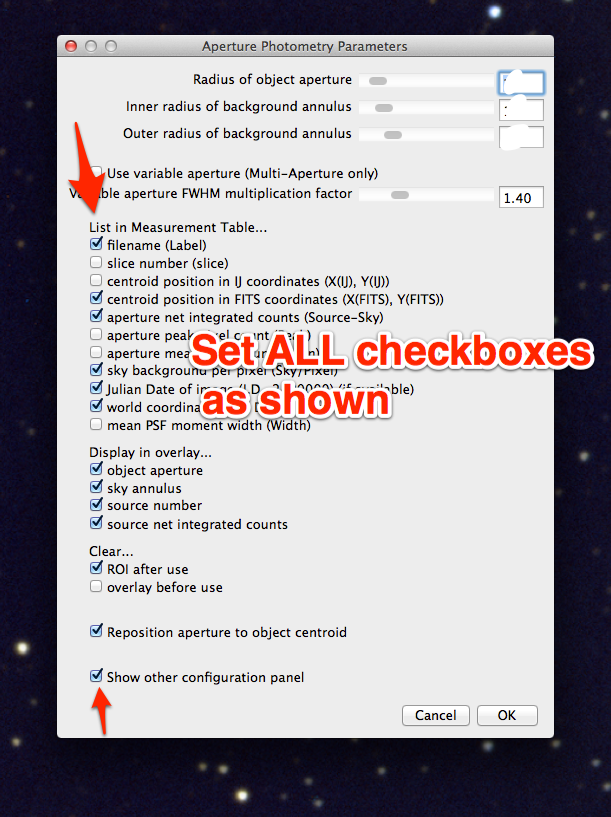
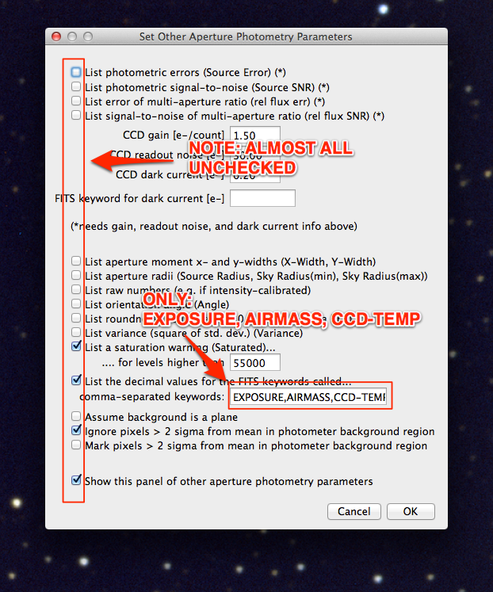

Photometry setup
===================

Recall that the radius you choose for the aperture you use for photometry can have a large impact on how accurate your final result is.

Choose the aperture size
------------------------

You will explore in a homework how to choose the optimal aperture size (you saw an illustration of it in the lecture right before spring break); for now: 

+ Set the aperture radius to 1.5 times the FWHM of one of the dimmer stars in the first image.

    + If you need a reminder as to how to find the FWHM look at this `page from the last lab`_

+ Make the gap between the aperture radius and the inner sky radius at least 5 pixels.
+ Choose an outer sky radius such that the number of pixels in the sky annulus is at least twice as large as the number of pixels in the aperture.

    + Remember, you find the number of pixels by just finding the area.
    + A large number of background pixels reduces the error in your final measurements.

.. todo::

    1. Write down the FWHM, aperture size, inner sky radius and outer sky radius you chose.

Set up photometry for bare-bones data collection
--------------------------------------------------

The settings we will use today are **NOT** appropriate for most times you do data collection, because we won't have AstroImageJ calculate error and SNR for us. These settings have the advantage of being easier to work with after we export to Excel, though.

+ Get to the aperture photometry settings by by clicking on the "Set Photometry" button, or double clicking the aperture photometry button or by going to the appropriate menu in AIJ.
+ In the first screen, uncheck many of the boxes, as shown here: |photometry-screen-1|
+ In the second screen also uncheck most of the boxes and set only a few FITS keywords to be saved, as shown here: |photometry-screen-2|

.. _page from the last lab: http://physics.mnstate.edu/craig/06_photometry_intro/photometry_aij.html#initial-guess-for-the-aperture-size

.. _last lab: http://physics.mnstate.edu/craig/06_photometry_intro/photometry_aij.html#setting-up-aperture-photometry

